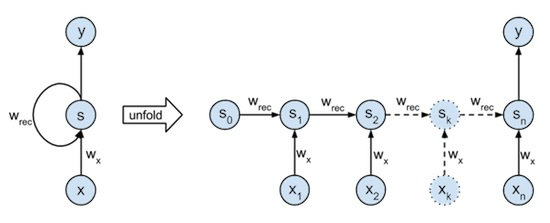

# Wacker#54

---

  <small>
  Wacker #54　2020/10/18(日)  
  </small>

 

### 機械学習（Deep Learning）についてしらべてみた

 

 Yohei Taniguchi 

  <small>

    [Wacker](http://wacker.io/)

  </small>

  

---

## AIと機械学習とDeep Learning 

---

### 強いAIと弱いAI

- 強いAI = 人間の知能そのものをもつ機械を作ろうとする立場
- 弱いAI = 人間が知能を使ってすることを機械にさせようとする立場

---

### 研究分野

参照：人工知能学会 What's AIより

---

### 機械学習の技術マップと・Deep Learning立ち位置

機械学習によって、人が行う学習と推論によって、分類と推測を行う

1. 教師なし
 - クラスタリング
2. 教師あり
 - 分類
 - 回帰
3. 強化学習
 - 行動結果に報酬と罰で学習

---

### 教師なし 

未知のデータや新たなデータ構造の発見を行う

- K平均法

---

### 教師あり 

事前の学習データを元に分類、推測を行う手法

- 決定木、ランダムフォレスト
- パーセプトロン、ニューラルネットワーク

---

### 強化学習 

教師あり学習で行った結果に良い悪いの重み付けをして行う手法

- CPにゲームをさせるケースに使われる

---

### MLP（Multilayer perceptron 多層パーセプトロン）

---

### CNN（Convolutional Neural Network 畳み込みニューラルネット）1/3 

---

### CNN（Convolutional Neural Network 畳み込みニューラルネット）2/3 

---

### CNN（Convolutional Neural Network 畳み込みニューラルネット）3/3 

---

### RNN（Recurrent Neural Network 再帰型ニューラルネット）

文字入力の候補を予測して出す

---

### GAN（Generative Adversarial Network 敵対的生成ネットワーク）

生成ネットワーク（generator）と識別ネットワーク（discriminator）の2つのネットワークから構成
- 生成側がイメージを出力し、識別側がその正否を判定する。
- 生成側は識別側を欺こうと学習し、識別側はより正確に識別しようと学習する。
画像生成で活用

---

### GPT（Generative Pre-trained Transformer ）

GPT-3:OpenAIによって作成されたGPT-nシリーズの第3世代の言語予測モデル
自然言語処理（NLP）のトレンド
Transformerベースのモデル（RNNもCNNも使わずに Attentionのみを使用 したEncoder-Decoderモデル）
文章生成で活用

---

## プログラミングにおける機械学習のフレームワーク 

---

#### フレームワーク 1/2 

- [TensorFlow](https://www.tensorflow.org/?hl=ja)
- [Keras](https://keras.io/ja/)
- [scikit-learn](https://scikit-learn.org/stable/)

---

#### フレームワーク 2/2 

- [CNTK](https://docs.microsoft.com/ja-jp/cognitive-toolkit/):MS,C++,Python
- [Chainer](https://chainer.org/):Preferred Networks,Python
- [Pytorch](https://pytorch.org/):FB + NVIDIA,Python,ChainerのForkでCaffe2とマージ

---

#### 主なデータセット 

- [Kaggle](https://www.kaggle.com/)
- [UCI](http://archive.ics.uci.edu/ml/index.php)
- [datamarket](https://datamarket.com/data/)
- スクレイピング

---

## AIの活用 

---

## AIの共働きスタイル 

- AIがする仕事
- AIがする仕事を人が補助
- 人がする仕事をAIが拡張
- 人がする仕事をAIが補助
- 人がする仕事

---

## AIの共働きスタイル 

- AIがする仕事・・・監視業務 識別系AI
- AIがする仕事を人が補助・・・運転業務 制御系AI
- 人がする仕事をAIが拡張・・・医療業務 識別系AI
- 人がする仕事をAIが補助・・・営業業務 会話系AI
- 人がする仕事・・・クリエイティブ

---

## AI活用分類 4 ✕ 2 = 8分類 

### 機能
- 識別系・・・画像、音声識別
- 予測系・・・需要予測、異常検出
- 会話系・・・チャット、翻訳
- 実行系・・・ドローン、制御系

---

## AI活用分類 4 ✕ 2 = 8分類 

### 役割
- 代行・・・人間が出来る事をAIがする
- 拡張・・・人間が出来ない事をAIで出来るようにする

- 識別・代行・・・大量画像の判定
- 識別・拡張・・・医療画像（レントゲン）から癌発見

---

## 参考情報

- [いちばんやさしいディープラーニング入門](https://www.amazon.co.jp/%E3%81%84%E3%81%A1%E3%81%B0%E3%82%93%E3%82%84%E3%81%95%E3%81%97%E3%81%84-%E3%83%87%E3%82%A3%E3%83%BC%E3%83%97%E3%83%A9%E3%83%BC%E3%83%8B%E3%83%B3%E3%82%B0-%E5%85%A5%E9%96%80%E6%95%99%E5%AE%A4-%E8%B0%B7%E5%B2%A1-%E5%BA%83%E6%A8%B9/dp/4800711878)

- 人工知能学会 What's AI : [http://www.ai-gakkai.or.jp/whatsai/AIresearch.html](http://www.ai-gakkai.or.jp/whatsai/AIresearch.html)
- [kaggle](https://www.codexa.net/what-is-kaggle/)
- [GPT-3](https://en.wikipedia.org/wiki/GPT-3)
- [文系ＡＩ人材になる―統計・プログラム知識は不要](https://www.amazon.co.jp/dp/B0828D1TYR/)
